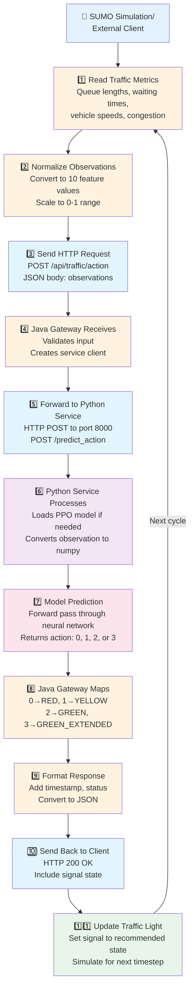

# 10. Complete End-to-End Workflow

```mermaid
graph TB
    Client["🚗 SUMO Simulation/<br/>External Client"]
    
    Step1["1️⃣ Read Traffic Metrics<br/>Queue lengths, waiting times,<br/>vehicle speeds, congestion"]
    
    Step2["2️⃣ Normalize Observations<br/>Convert to 10 feature values<br/>Scale to 0-1 range"]
    
    Step3["3️⃣ Send HTTP Request<br/>POST /api/traffic/action<br/>JSON body: observations"]
    
    Step4["4️⃣ Java Gateway Receives<br/>Validates input<br/>Creates service client"]
    
    Step5["5️⃣ Forward to Python Service<br/>HTTP POST to port 8000<br/>POST /predict_action"]
    
    Step6["6️⃣ Python Service Processes<br/>Loads PPO model if needed<br/>Converts observation to numpy"]
    
    Step7["7️⃣ Model Prediction<br/>Forward pass through neural network<br/>Returns action: 0, 1, 2, or 3"]
    
    Step8["8️⃣ Java Gateway Maps<br/>0→RED, 1→YELLOW<br/>2→GREEN, 3→GREEN_EXTENDED"]
    
    Step9["9️⃣ Format Response<br/>Add timestamp, status<br/>Convert to JSON"]
    
    Step10["🔟 Send Back to Client<br/>HTTP 200 OK<br/>Include signal state"]
    
    Step11["1️⃣1️⃣ Update Traffic Light<br/>Set signal to recommended state<br/>Simulate for next timestep"]
    
    Client --> Step1
    Step1 --> Step2
    Step2 --> Step3
    Step3 --> Step4
    Step4 --> Step5
    Step5 --> Step6
    Step6 --> Step7
    Step7 --> Step8
    Step8 --> Step9
    Step9 --> Step10
    Step10 --> Step11
    Step11 -->|Next cycle| Step1
    
    style Client fill:#e3f2fd
    style Step1 fill:#fff3e0
    style Step2 fill:#fff3e0
    style Step3 fill:#e1f5fe
    style Step4 fill:#fff3e0
    style Step5 fill:#e1f5fe
    style Step6 fill:#f3e5f5
    style Step7 fill:#fce4ec
    style Step8 fill:#fff3e0
    style Step9 fill:#fff3e0
    style Step10 fill:#e1f5fe
    style Step11 fill:#e8f5e9
```