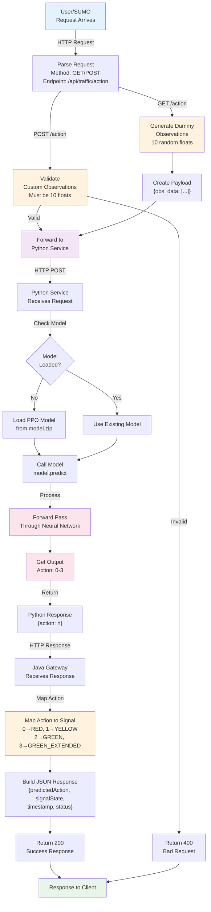

# 4. Data Flow Through System

```mermaid
graph TD
    Start["User/SUMO<br/>Request Arrives"]
    
    Start -->|HTTP Request| ParseReq["Parse Request<br/>Method: GET/POST<br/>Endpoint: /api/traffic/action"]
    
    ParseReq -->|GET /action| AutoGen["Generate Dummy<br/>Observations<br/>10 random floats"]
    ParseReq -->|POST /action| ValidateObs["Validate<br/>Custom Observations<br/>Must be 10 floats"]
    
    ValidateObs -->|Invalid| ReturnError400["Return 400<br/>Bad Request"]
    ValidateObs -->|Valid| FwdPython["Forward to<br/>Python Service"]
    
    AutoGen --> CreatePayload["Create Payload<br/>{obs_data: [...]}"]
    CreatePayload --> FwdPython
    
    FwdPython -->|HTTP POST| PythonReceive["Python Service<br/>Receives Request"]
    
    PythonReceive -->|Check Model| ModelLoaded{"Model<br/>Loaded?"}
    
    ModelLoaded -->|No| LoadModel["Load PPO Model<br/>from model.zip"]
    ModelLoaded -->|Yes| UseModel["Use Existing Model"]
    
    LoadModel --> Predict
    UseModel --> Predict["Call Model<br/>model.predict"]
    
    Predict -->|Process| Forward["Forward Pass<br/>Through Neural Network"]
    Forward --> Output["Get Output<br/>Action: 0-3"]
    
    Output -->|Return| ResponsePython["Python Response<br/>{action: n}"]
    
    ResponsePython -->|HTTP Response| JavaGateway["Java Gateway<br/>Receives Response"]
    
    JavaGateway -->|Map Action| MapSignal["Map Action to Signal<br/>0→RED, 1→YELLOW<br/>2→GREEN, 3→GREEN_EXTENDED"]
    
    MapSignal --> BuildResp["Build JSON Response<br/>{predictedAction, signalState,<br/>timestamp, status}"]
    
    BuildResp --> ReturnSuccess["Return 200<br/>Success Response"]
    
    ReturnSuccess --> Client["Response to Client"]
    ReturnError400 --> Client
    
    style Start fill:#e3f2fd
    style AutoGen fill:#fff3e0
    style ValidateObs fill:#fff3e0
    style FwdPython fill:#f3e5f5
    style Forward fill:#fce4ec
    style Output fill:#fce4ec
    style MapSignal fill:#fff3e0
    style Client fill:#e8f5e9
```