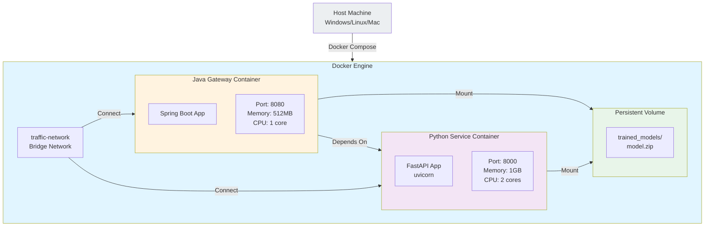

# 5. Deployment Architecture

```mermaid
graph TB
    Host["Host Machine<br/>Windows/Linux/Mac"]
    
    subgraph DockerEng["Docker Engine"]
        Network["traffic-network<br/>Bridge Network"]
        
        subgraph Container1["Java Gateway Container"]
            JG["Spring Boot App"]
            Config1["Port: 8080<br/>Memory: 512MB<br/>CPU: 1 core"]
        end
        
        subgraph Container2["Python Service Container"]
            PS["FastAPI App<br/>uvicorn"]
            Config2["Port: 8000<br/>Memory: 1GB<br/>CPU: 2 cores"]
        end
        
        subgraph Volume["Persistent Volume"]
            Models["trained_models/<br/>model.zip"]
        end
    end
    
    Host -->|Docker Compose| DockerEng
    Network -->|Connect| Container1
    Network -->|Connect| Container2
    Container1 -->|Mount| Volume
    Container2 -->|Mount| Volume
    
    Container1 -->|Depends On| Container2
    
    style Host fill:#eceff1
    style DockerEng fill:#e1f5ff
    style Container1 fill:#fff3e0
    style Container2 fill:#f3e5f5
    style Volume fill:#e8f5e9
```