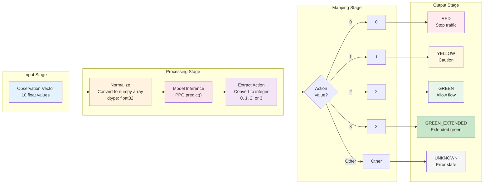

# 6. Detailed Internal Flow - Action Prediction

```mermaid
graph LR
    subgraph Input["Input Stage"]
        Obs["Observation Vector<br/>10 float values"]
    end
    
    subgraph Processing["Processing Stage"]
        Normalize["Normalize<br/>Convert to numpy array<br/>dtype: float32"]
        ModelInfer["Model Inference<br/>PPO.predict()"]
        Extract["Extract Action<br/>Convert to integer<br/>0, 1, 2, or 3"]
    end
    
    subgraph Mapping["Mapping Stage"]
        Switch{"Action<br/>Value?"}
        A0["0"]
        A1["1"]
        A2["2"]
        A3["3"]
        Default["Other"]
    end
    
    subgraph Output["Output Stage"]
        Red["RED<br/>Stop traffic"]
        Yellow["YELLOW<br/>Caution"]
        Green["GREEN<br/>Allow flow"]
        Extended["GREEN_EXTENDED<br/>Extended green"]
        Unknown["UNKNOWN<br/>Error state"]
    end
    
    Obs --> Normalize
    Normalize --> ModelInfer
    ModelInfer --> Extract
    Extract --> Switch
    Switch -->|0| A0
    Switch -->|1| A1
    Switch -->|2| A2
    Switch -->|3| A3
    Switch -->|Other| Default
    A0 --> Red
    A1 --> Yellow
    A2 --> Green
    A3 --> Extended
    Default --> Unknown
    
    style Obs fill:#e3f2fd
    style Normalize fill:#fff3e0
    style ModelInfer fill:#fce4ec
    style Extract fill:#f3e5f5
    style Red fill:#ffebee
    style Yellow fill:#fff8e1
    style Green fill:#e8f5e9
    style Extended fill:#c8e6c9
    style Unknown fill:#f5f5f5
```