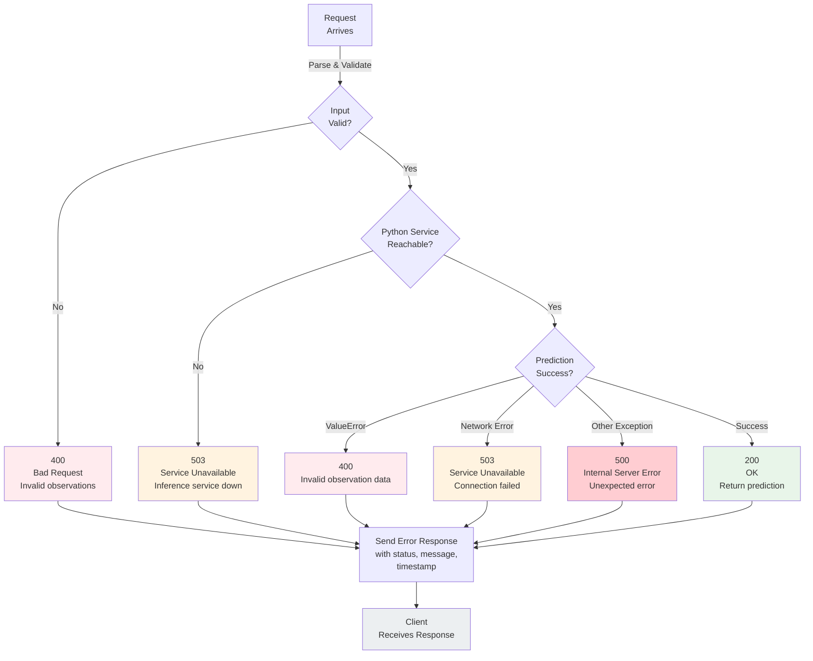

# 7. Error Handling Flow

```mermaid
graph TD
    Request["Request<br/>Arrives"]
    
    Request -->|Parse & Validate| Validation{Input<br/>Valid?}
    
    Validation -->|No| BadReq["400<br/>Bad Request<br/>Invalid observations"]
    
    Validation -->|Yes| CanConnect{Python Service<br/>Reachable?}
    
    CanConnect -->|No| Unavail["503<br/>Service Unavailable<br/>Inference service down"]
    
    CanConnect -->|Yes| Predict{Prediction<br/>Success?}
    
    Predict -->|ValueError| BadVal["400<br/>Invalid observation data"]
    
    Predict -->|Network Error| NetErr["503<br/>Service Unavailable<br/>Connection failed"]
    
    Predict -->|Other Exception| ServerErr["500<br/>Internal Server Error<br/>Unexpected error"]
    
    Predict -->|Success| Success["200<br/>OK<br/>Return prediction"]
    
    BadReq --> Response["Send Error Response<br/>with status, message,<br/>timestamp"]
    Unavail --> Response
    BadVal --> Response
    NetErr --> Response
    ServerErr --> Response
    Success --> Response
    Response --> Client["Client<br/>Receives Response"]
    
    style BadReq fill:#ffebee
    style Unavail fill:#fff3e0
    style BadVal fill:#ffebee
    style NetErr fill:#fff3e0
    style ServerErr fill:#ffcdd2
    style Success fill:#e8f5e9
    style Client fill:#eceff1
```