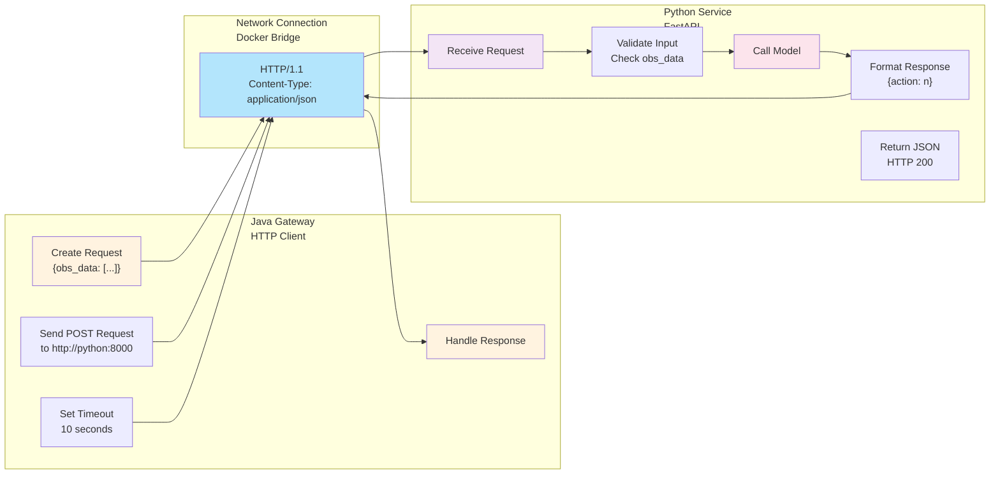

# 8. Inter-Service Communication Protocol

```mermaid
graph LR
    subgraph JavaGW["Java Gateway<br/>HTTP Client"]
        Create["Create Request<br/>{obs_data: [...]}"]
        Send["Send POST Request<br/>to http://python:8000"]
        Timeout["Set Timeout<br/>10 seconds"]
        Handle["Handle Response"]
    end
    
    subgraph Network["Network Connection<br/>Docker Bridge"]
        HTTP["HTTP/1.1<br/>Content-Type: application/json"]
    end
    
    subgraph PythonSVC["Python Service<br/>FastAPI"]
        Receive["Receive Request"]
        ValidateInput["Validate Input<br/>Check obs_data"]
        Predict["Call Model"]
        Format["Format Response<br/>{action: n}"]
        ReturnResp["Return JSON<br/>HTTP 200"]
    end
    
    Create --> HTTP
    Send --> HTTP
    Timeout --> HTTP
    HTTP --> Receive
    Receive --> ValidateInput
    ValidateInput --> Predict
    Predict --> Format
    Format --> HTTP
    HTTP --> Handle
    
    style Create fill:#fff3e0
    style HTTP fill:#b3e5fc
    style Receive fill:#f3e5f5
    style Predict fill:#fce4ec
    style Handle fill:#fff3e0
```