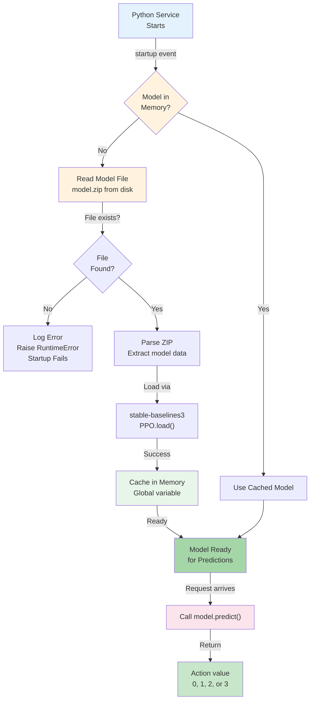

# 9. Model Loading & Caching Strategy

```mermaid
graph TD
    Start["Python Service<br/>Starts"]
    
    Start -->|startup event| Check{Model in<br/>Memory?}
    
    Check -->|Yes| Use["Use Cached Model"]
    
    Check -->|No| LoadFile["Read Model File<br/>model.zip from disk"]
    
    LoadFile -->|File exists?| Found{File<br/>Found?}
    
    Found -->|No| Error["Log Error<br/>Raise RuntimeError<br/>Startup Fails"]
    
    Found -->|Yes| Parse["Parse ZIP<br/>Extract model data"]
    
    Parse -->|Load via| StableBase["stable-baselines3<br/>PPO.load()"]
    
    StableBase -->|Success| Cache["Cache in Memory<br/>Global variable"]
    
    Cache -->|Ready| Ready["Model Ready<br/>for Predictions"]
    
    Use --> Ready
    
    Ready -->|Request arrives| Predict["Call model.predict()"]
    
    Predict -->|Return| Action["Action value<br/>0, 1, 2, or 3"]
    
    style Start fill:#e3f2fd
    style Check fill:#fff3e0
    style LoadFile fill:#fff3e0
    style Cache fill:#e8f5e9
    style Ready fill:#a5d6a7
    style Predict fill:#fce4ec
    style Action fill:#c8e6c9
```