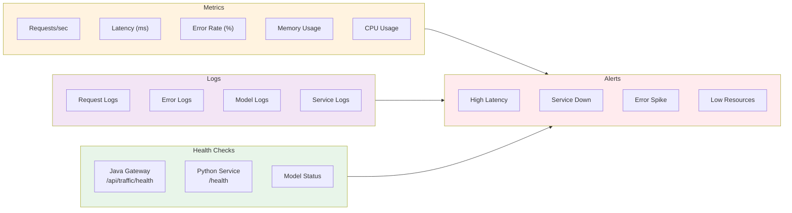

# 15. Monitoring & Observability Points

```mermaid
graph LR
    subgraph Metrics["Metrics"]
        RPS["Requests/sec"]
        Latency["Latency (ms)"]
        ErrorRate["Error Rate (%)"]
        Memory["Memory Usage"]
        CPU["CPU Usage"]
    end
    
    subgraph Logs["Logs"]
        RequestLog["Request Logs"]
        ErrorLog["Error Logs"]
        ModelLog["Model Logs"]
        ServiceLog["Service Logs"]
    end
    
    subgraph Health["Health Checks"]
        JavaHealth["Java Gateway<br>/api/traffic/health"]
        PythonHealth["Python Service<br>/health"]
        ModelHealth["Model Status"]
    end
    
    subgraph Alerting["Alerts"]
        HighLatency["High Latency"]
        ServiceDown["Service Down"]
        ErrorSpike["Error Spike"]
        ResourceLow["Low Resources"]
    end
    
    Metrics --> Alerting
    Logs --> Alerting
    Health --> Alerting
    
    style Metrics fill:#fff3e0
    style Logs fill:#f3e5f5
    style Health fill:#e8f5e9
    style Alerting fill:#ffebee
```