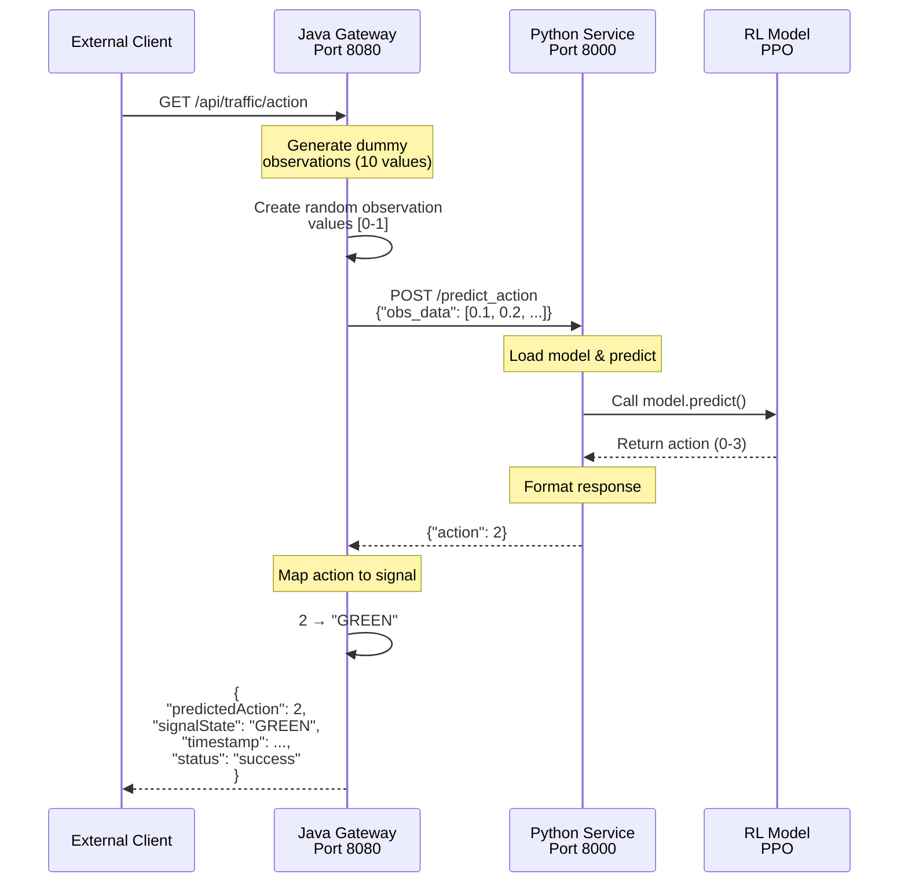
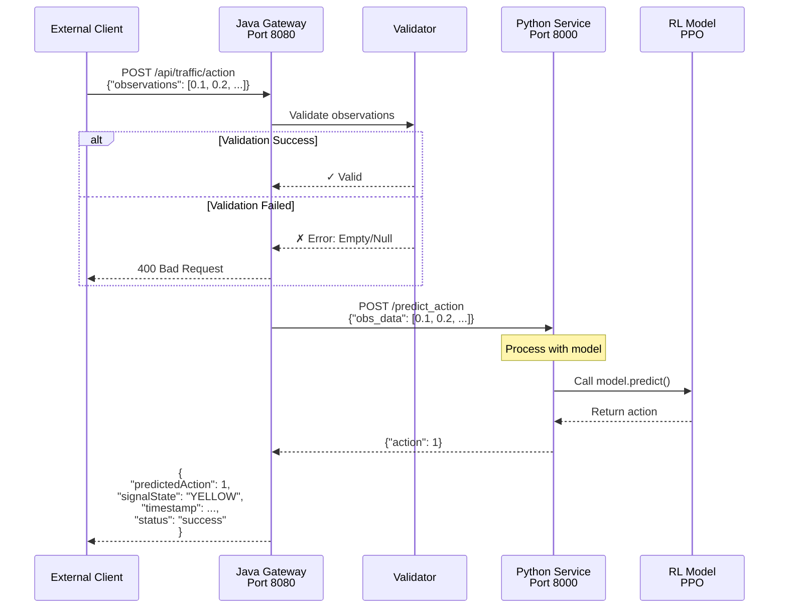
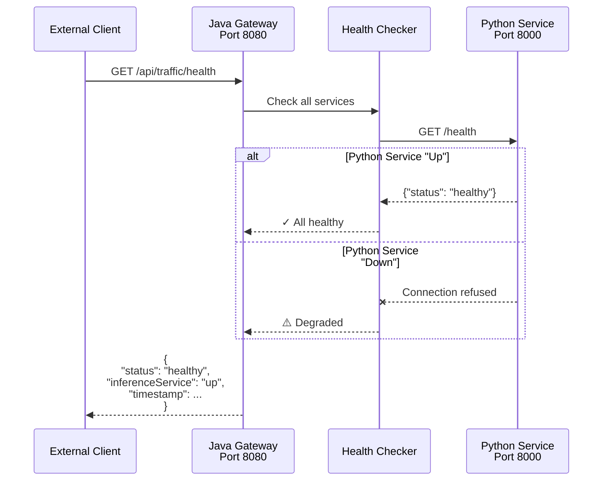

# 2. Request-Response Flow Diagram

## **GET /api/traffic/action** (Auto-generated observations)

## **POST /api/traffic/action** (Custom observations)

## **GET /api/traffic/health** (Health Check)

