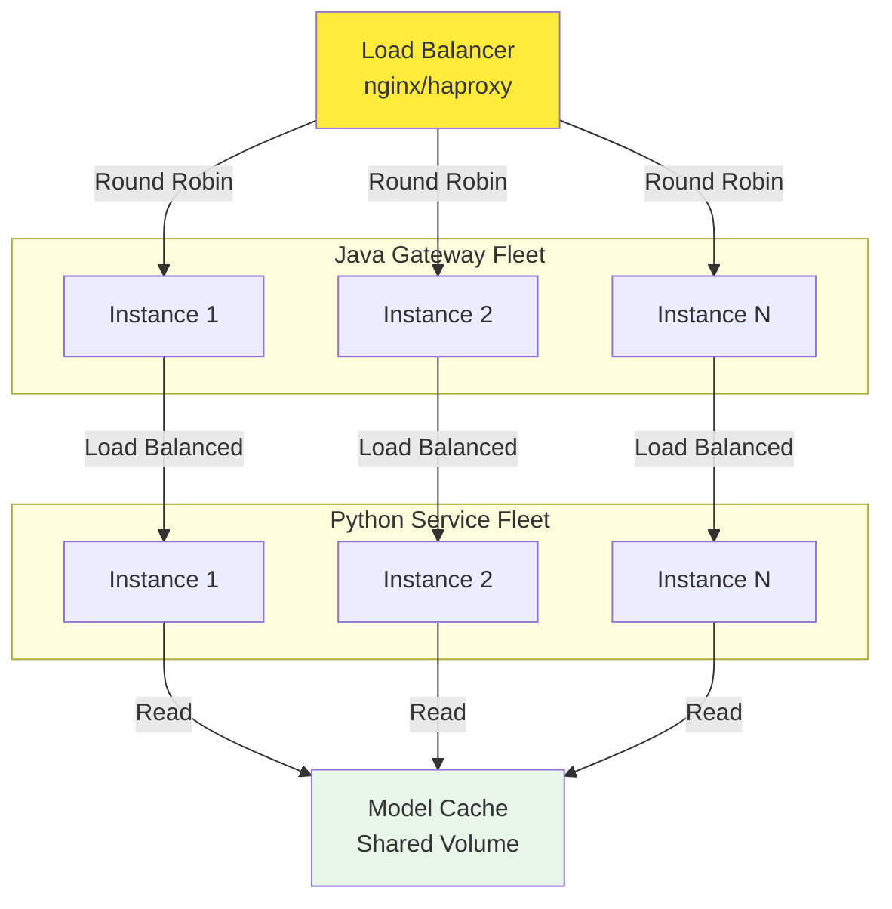

# 13. Scalability Considerations

### **Horizontal Scaling**

### **Vertical Scaling**

- Increase container memory (Python: 1GB → 4GB)
- Increase CPU allocation (Java: 1 core → 4 cores)
- Use GPU acceleration for Python service (CUDA-enabled Docker)
