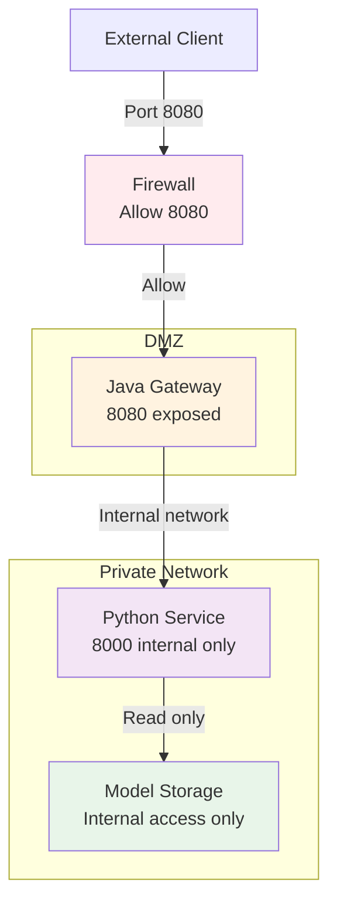

# 14. Security Architecture

```mermaid
graph TB
    Client["External Client"]
    Firewall["Firewall<br/>Allow 8080"]
    
    subgraph DMZ["DMZ"]
        Gateway["Java Gateway<br/>8080 exposed"]
    end
    
    subgraph Private["Private Network"]
        Python["Python Service<br/>8000 internal only"]
        Storage["Model Storage<br/>Internal access only"]
    end
    
    Client -->|Port 8080| Firewall
    Firewall -->|Allow| Gateway
    Gateway -->|Internal network| Python
    Python -->|Read only| Storage
    
    style Firewall fill:#ffebee
    style Gateway fill:#fff3e0
    style Python fill:#f3e5f5
    style Storage fill:#e8f5e9
```