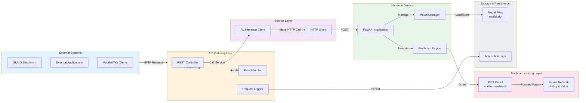

# 3. System Component Architecture

```mermaid
graph LR
    subgraph External["External Systems"]
        SUMO["SUMO Simulation"]
        ExtApp["External Applications"]
        Mobile["Mobile/Web Clients"]
    end
    
    subgraph Gateway["API Gateway Layer"]
        REST["REST Controller"]
        ErrorHandler["Error Handler"]
        Logger["Request Logger"]
    end
    
    subgraph ServiceLayer["Service Layer"]
        Client["RL Inference Client"]
        HTTPClient["HTTP Client"]
    end
    
    subgraph InferenceService["Inference Service"]
        FastAPI["FastAPI Application"]
        ModelMgmt["Model Manager"]
        PredictionEngine["Prediction Engine"]
    end
    
    subgraph MLLayer["Machine Learning Layer"]
        PPOModel["PPO Model<br/>stable-baselines3"]
        NeuralNet["Neural Network<br/>Policy & Value"]
    end
    
    subgraph Storage["Storage & Persistence"]
        ModelFiles["Model Files<br/>model.zip"]
        Logs["Application Logs"]
    end
    
    External -->|HTTP Request| Gateway
    Gateway -->|Validate/Log| REST
    Gateway -->|Handle Errors| ErrorHandler
    REST -->|Call Service| Client
    Client -->|Make HTTP Call| HTTPClient
    HTTPClient -->|POST| FastAPI
    FastAPI -->|Manage| ModelMgmt
    FastAPI -->|Execute| PredictionEngine
    PredictionEngine -->|Query| PPOModel
    PPOModel -->|Forward Pass| NeuralNet
    ModelMgmt -->|Load/Store| ModelFiles
    Logger -->|Persist| Logs
    
    style External fill:#e3f2fd
    style Gateway fill:#fff3e0
    style ServiceLayer fill:#f3e5f5
    style InferenceService fill:#e8f5e9
    style MLLayer fill:#fce4ec
    style Storage fill:#eceff1
```